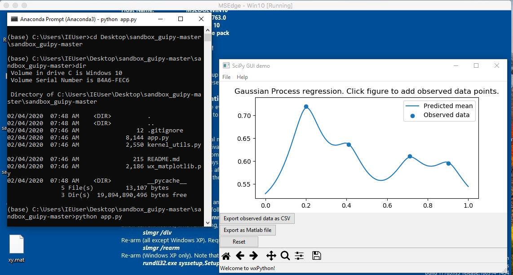

## Setup

This consists of:

- installing a [Python 3.x](https://python.org/) runtime, 
- installing the appropriate Python libraries ([SciPy](https://www.scipy.org/) and [WxPython](https://wxpython.org/))
- downloading this code repository on your computer.
- opening a Command Prompt at this repository.

We propose detailed instructions on how to do this on Windows, using the Anaconda distribution:


### With Anaconda on Windows

1. Install [Anaconda](https://www.anaconda.com/distribution/). As a side effect, this will install the SciPy libraries.
2. Once Anaconda is installed, open the Anaconda Prompt application.
3. Install the WxPython library by executing this command in the Anaconda Prompt: `conda install -c conda-forge wxpython`. If this gets stuck: close the prompt, restart it, execute the command `conda config --set repodata_threads 2`, then try again the initial command.
4. Download this code repository on your computer (you can do this by clicking 'clone or download' on Github, then choosing "Download ZIP", then extracting the ZIP archive somewhere). I'll now assumy that this repository is located at `Desktop\sandbox_guipy_master\sandbox_guipy_master`.
5. In the Anaconda Prompt, move to the location of the repository, e.g by executing command: `cd Desktop\sandbox_guipy_master\sandbox_guipy_master` (adapt this command if you downloaded the repository elsewhere). **Checkpoint:** execute the `dir` command - you should see `app.py` among the files listed.


## Running the program

You should now be inside a Cmd Prompt at the directory of this repository, as described in [Setup](#Setup).

Run the program by executing the command: `python app.py`

You should see a window open, looking like the following:




## Running on Mac OS

``` 
conda install -c anaconda python.app
pythonw app.py
```
